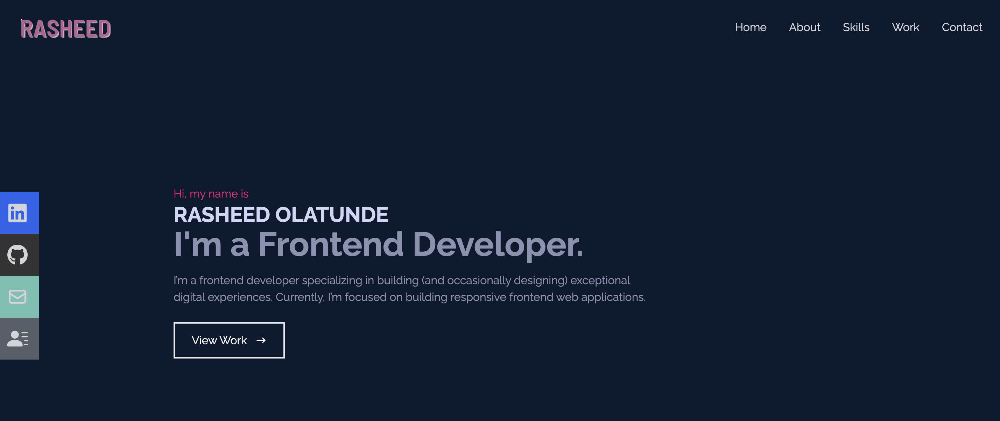

<div align="center">
<h1>Portfolion</h1>
<h6><i>Rasheed Olatunde Portfolio Web Application</i></h6>
<hr />
</div>

Hello, 👋 \
I'm Rasheed Olatunde (Frontend Developer)
```
Here's some notes about my detail link about my portfolio: 👎

1. A link to the repository of my portfolio:  https://github.com/olatunde1998/portfolio-react

2. A publicly live hosted URL of the portfolio:  https://geodev-portfolio-app.netlify.app/

```
# Technologies 

 + [JavaScript](https://javascript.info/) 
 + [ReactJs](https://react.dev/) 
 + [TailwindCss](https://tailwindcss.com/) 
 + [Vercel](https://vercel.com/dashboard) 


# Prototype

 
# How to Contribute

1. Clone the repository 
$ git clone [https://github.com/olatunde1998/portfolio-react](https://geodev-portfolio-app.netlify.app/)

2. Change directory into the cloned folder and run the setup script
$ cd portfolio-react

3. Open your terminal and type this command `yarn add ` or `npm install` to add the react dependency to the app in the development mode.

4. Then after the installation of the  dependency type this command  `yarn start` to run the app in your local environment 

5. Copy this link [http://localhost:3000/](http://localhost:3000/) and paste it to your web browser(Chrome, safari, mozilla firefox et.c) to view it.


# Deployment
Vercel was used to deploy the app. 
 + [Vercel](https://www.netlify.com/)

# License
The MIT License - Copyright (c) 2023 - Present, rasheed-olatunde portfolio project/  Storage Service.

# Author
Rasheed Olatunde
